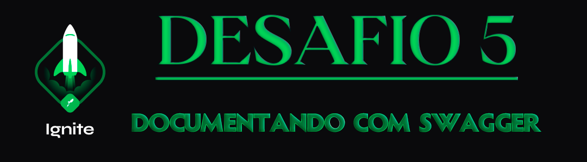

  

<h1 align="center"> RocketSeat 🚀 Ignite NodeJS 🌠</h1>

  
  
  
  

## 🧠 Detalhes do desafio

Nesse desafio, você deverá criar uma aplicação para treinar o que aprendeu até agora no Node.js!

Utilizando uma aplicação já funcional como base, realize a documentação das rotas com o Swagger.

A documentação deve servir como uma descrição das entradas e saídas da sua API. Abaixo sugerimos os principais pontos que você deve documentar:

- [x] Informações gerais da API (nome, descrição, etc.);
- [x] Rotas;
- [x] Parâmetros;
- [x] Corpo da Requisição;
- [x] Respostas de sucesso;
- [x] Respostas de erro;
- [x] Exemplos.

  

Feito com ❤️ por [Augusto Hermes](https://github.com/augustohermes) 👋.
